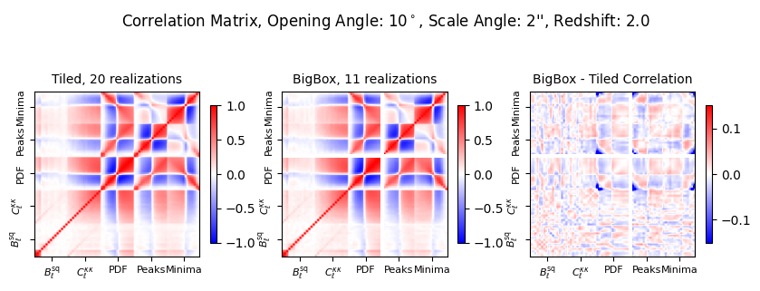
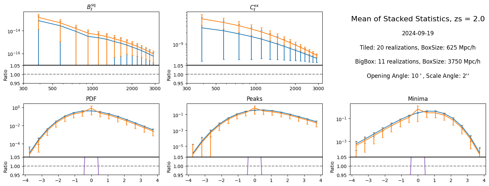
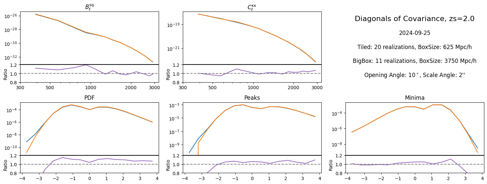

# LensingSSC

LensingSSC is a Python package for studying **Super-Sample Covariance (SSC)** effects in weak gravitational lensing simulations. It provides tools for data preprocessing, statistical analysis, and the generation of lightcone-based simulations. The code in this repository underpins the research presented in the paper *"Lensing Super Sample Covariance"* by Akira Tokiwa, Adrian E. Bayer, Jia Liu, and Masahiro Takada.

---

## Table of Contents

- [Introduction](#introduction)
- [Features](#features)
- [Project Structure](#project-structure)
- [Statistical Quantities](#statistical-quantities)
- [Installation](#installation)
  - [Prerequisites](#prerequisites)
  - [Installing the Package](#installing-the-package)
- [Usage](#usage)
- [Results & Analysis](#results--analysis)
- [Contributing](#contributing)
- [References](#references)
- [License](#license)

---

## Introduction

Super-Sample Covariance (SSC) represents the impact of modes larger than the survey area on measured statistics in weak lensing maps. LensingSSC is designed to:
- Preprocess and patch simulation data
- Perform higher-order statistical analysis
- Facilitate comparative studies between different simulation setups

This package is ideal for researchers and practitioners working with large-scale structure and weak lensing surveys.

---

## Features

- **Preprocessing Modules:**  
  Tools for lightcone patching and data preprocessing.
  
- **Statistical Analysis:**  
  Functions to compute higher-order statistics such as power spectra, bispectra, and probability density functions.
  
- **Example Notebooks:**  
  Jupyter notebooks that demonstrate package usage and typical workflows.
  
- **Unit Testing:**  
  Built-in tests to ensure accuracy and robustness.
  
- **Extensible Configuration:**  
  YAML-based configuration files for flexible customization of analysis parameters.

---

## Project Structure

```plaintext
lensing-ssc/
├── LICENSE               # MIT License
├── README.md             # Main documentation
├── setup.py              # Package installation script
├── requirements.txt      # Python dependencies
├── docs/                 # Documentation files
│   ├── installation.md   # Detailed installation guide
│   ├── usage.md          # Usage instructions
│   └── api/              # API documentation
├── examples/             # Example notebooks and scripts
│   ├── notebooks/        # Jupyter notebooks
│   └── scripts/          # Example scripts
├── tests/                # Unit tests
│   ├── __init__.py
│   └── test_*.py         # Test modules
├── lensing_ssc/          # Main package source code
│   ├── __init__.py
│   ├── core/             # Core functionality
│   │   ├── preprocessing/
│   │   ├── patch/
│   │   └── fibonacci/
│   ├── stats/            # Statistical analysis modules
│   └── utils/            # Utility functions
├── configs/              # YAML configuration files
│   └── default.yaml
└── .gitignore            # Git ignore rules
```

*Each directory is organized to separate the core functionalities, examples, tests, and documentation.*

---

## Statistical Quantities

LensingSSC calculates various statistical quantities on weak lensing maps, including:

- **Power Spectrum:**  
  Uses `lenstools.ConvergenceMap.powerSpectrum` to capture the power distribution across scales.
  
- **Squeezed Bispectrum:**  
  Computed via `lenstools.ConvergenceMap.bispectrum` for nonlinear structure analysis.
  
- **Probability Density Function (PDF):**  
  Analyzes the convergence map distribution using `lenstools.ConvergenceMap.pdf`.
  
- **Peak/Minima Statistics:**  
  Identifies features in the maps with `lenstools.ConvergenceMap.locatePeaks`.

---

## Installation

### Prerequisites

1. **Install `nbodykit`:**
   ```sh
   conda install -c bccp nbodykit
   ```
2. **Install CLASS via Cobaya:**
   ```sh
   python -m pip install cobaya --upgrade
   mkdir ./lib
   cobaya-install cosmo -p ./lib
   ```

### Installing the Package

1. **Clone the repository:**
   ```sh
   git clone https://github.com/atokiwaipmu/LensingSSC.git
   cd LensingSSC
   ```
2. **Install the package:**
   ```sh
   python setup.py install
   ```

---

## Usage

### Generating Data

- **Generate Mass Sheets:**
  ```sh
  python -m src.preproc /path/to/usmesh
  ```

- **Generate Kappa Maps:**
  ```sh
  python -m src.kappamap /path/to/mass_sheets
  ```

- **Perform Statistical Analysis on Kappa Maps:**
  ```sh
  python -m src.analysis_patch /path/to/kappa
  ```

### Configuration

Configuration is managed via YAML files located in the `configs` directory. Key parameters include:
- `patch_size`
- `nbin`
- `lmin`, `lmax`
- Other analysis-specific parameters

For optimal performance, the package uses **Fibonacci-patched full-sky maps**.

---

## Results & Analysis

LensingSSC supports comparative studies between different simulation setups:

- **Large Boxes (e.g., 5 Gpc):**  
  Captures all modes, including those contributing to SSC.

- **Tiled Small Boxes (e.g., 500 Mpc):**  
  May miss large-scale modes, affecting redshift-dependent SSC effects.

### Sample Plots

- **Correlation Matrix:**  
  
  
- **Comparison of Mean Values:**  
  
  
- **Diagonal Covariance Terms:**  
  

---

## Contributing

Contributions are welcome! Please follow these guidelines:
- **Submit Issues:**  
  Report bugs or suggest enhancements via the GitHub issue tracker.
- **Pull Requests:**  
  Follow the established code style and include tests when adding new features.
- **Documentation:**  
  Ensure any changes include appropriate updates to the documentation.

For detailed guidelines, please see [CONTRIBUTING.md](CONTRIBUTING.md) (if available).

---

## References

- **Preprocessing for Lensing Maps:**  
  [preproc-kappa](https://github.com/HalfDomeSims/preproc-kappa.git)
- **Statistical Analysis:**  
  [HOS-Y1](https://github.com/LSSTDESC/HOS-Y1-prep.git)
- **Example Notebook:**  
  [CorrelatedSims](https://github.com/liuxx479/CorrelatedSims/blob/master/hack_crowncanyon_kappa.ipynb)
- **Job Submission Script:**  
  [sbatch_gen.py](https://github.com/liuxx479/CorrelatedSims/blob/master/sbatch_gen.py)

---

## License

This project is licensed under the [MIT License](LICENSE).

---

*For additional questions or support, please open an issue on GitHub or contact the project maintainers.*
