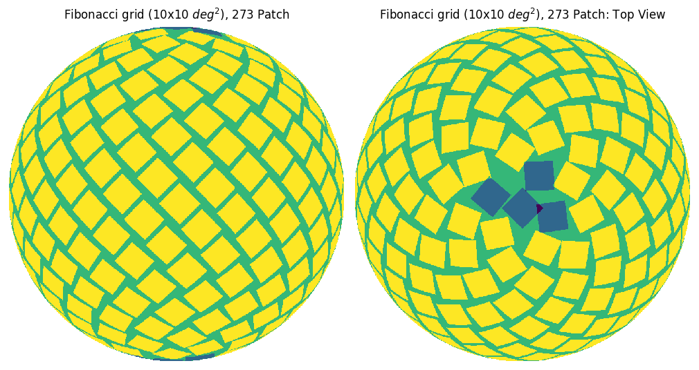

# LensingSSC

This repository contains the code used to produce the results in the paper "Lensing Super Sample Covariance" by Akira Tokiwa, Adrian E. Bayer, Jia Liu and Masahiro Takada.

<details>

<summary>Installation</summary>

### Prerequisites

1. Install `nbodykit` via conda:
   ```sh
   conda install -c bccp nbodykit
    ```

2. Install classy via cobaya:
    ```sh
    python -m pip install cobaya --upgrade
    mkdir ./lib
    cobaya-install cosmo -p ./lib
    ```

### Install the remaining dependencies and package

1. Clone the repository:
    ```sh
    git clone https://github.com/atokiwaipmu/LensingSSC.git
    cd LensingSSC
    ```

2. Install the remaining dependencies and the package:
    ```sh
    python setup.py install
    ```
</details>

## Goal of this research
- is our nominal setup of 1Gpc box sufficient in capturing SSC for HOS
- any HOS that are less sensitive to SSC?
- the redshift dependence of SSC contribution

## Setup
- Generate lensing maps using the big box `$(5 or 3.75 Gpc/h)$` and the heavily tiled box `$(625Mpc/h \times 8^3)$`


By comparing the lightcone and small box size in this setup, we can barely capture the SSC contribution for z_source < 2.0.
But we can capture the SSC contribution for z_source = 3.0.
- scale factor bins: [0.01, 0.02, .. , 0.98, 0.99]
- source_redshift zs = [0.5, 1.0, 2.0, 3.0]
- small box size = 625 Gpc/h
- big box size = 3.75 & 5 Gpc/h

To simplify the analysis, we will use patches of full-sky maps, which are patched in order of Fibonacci numbers.


## Generate kappa maps
### preprocessing the mass sheets
```sh
python -m src.preproc /path/to/usmesh
```
This will generate the mass sheets for each scale factor bin.
by default, it will create `/mass_sheets` directory in the same directory as the input file.
<details>

<summary>Option</summary>

- One can change the output directory by specifying the `--output` option.
- Data can be overwritten by specifying the `--overwrite` option.
```sh
python -m src.preproc /path/to/usmesh --output /path/to/mass_sheets --overwrite --config /path/to/config.yaml
```
</details>

### generate kappa maps
```sh
python -m src.kappamap /path/to/mass_sheets
```
This will generate the kappa maps for each source redshift. 
By default, it will create a `/kappa_maps` directory in the same location as the input file.
<details>

<summary>Option</summary>

- One can change the output directory by specifying the `--output` option.
- Data can be overwritten by specifying the `--overwrite` option.
- If needed, one can specify the source redshifts by giving the configuration file, through the `--config` option.
```sh
python -m src.kappamap /path/to/mass_sheets --output /path/to/kappa_maps --overwrite --config /path/to/config.yaml
```
</details>

### Do analysis on the kappa maps
```sh
python -m src.analysis_patch /path/to/kappa_maps 
```
This will generate the kappa maps using the Born approximation.
By default, it will create a `/flat` directory in the same location as the input file.
<details>

<summary>Option</summary>

- One can change the output directory by specifying the `--output` option.
- Data can be overwritten by specifying the `--overwrite` option.
- If needed, one can specify the analysis settings by giving the configuration file, through the `--config` option.
```sh
python -m src.analysis_patch /path/to/kappa_maps --output /path/to/flat --overwrite --config /path/to/config.yaml
```

</details>

## Statistics
The following statistics are calculated for the lensing maps ($`\ell \in [300, 3000]`$, $`SNR \in [-4, 4]`$):
- Power spectrum (`lenstools.ConvergenceMap.powerSpectrum`)
- Squeezed Bispectrum (`lenstools.ConvergenceMap.bispectrum`)
- PDF (`lenstools.ConvergenceMap.pdf`)
- Peak/Minima (`lenstools.ConvergenceMap.locatePeaks`)

## Methods
By comparing between HOS (peaks, minima, PDFs, etc) measured from:
- (1) lensing maps generated using the large boxes (5Gpc), which include all modes and hence capture SSC
- (2) lensing maps generated using tiled small boxes (500Mpc), which miss modes bigger than 500Mpc (SSC contribution would be redshift dependent, where at lower z, you receive less contribution and at high z, you miss a lot more SSC)
Both (1) and (2) capture the usual non-Gaussian information (they would have the same resolution), only differ in large-scale modes. 

## Money plots
- ratio of (co-)variance between (1) and (2) 
- the ratio as a function of source redshift zs=[0.5, 1, 1.5, 2, 2.5, 3]
- the ratio as a function of small box size=[0.5, 1, 2, 3..] Gpc
- the ratio for all the relevant statistics

### Sample plots
- Correlation matrix

- Comparison of mean

- Comparison of diagonal terms of the covariance matrix


## URLs for the contents
- [HalfDome](https://halfdomesims.github.io/)
- [LSST Y1 sims](https://docs.google.com/document/d/1wUc5joml9FFDijslaQth3-gvAAmvqU2NrVMbUUjOCyI/edit)
- [Google Slide](https://docs.google.com/presentation/d/1pFHoPImFvwqnGVIz9azB3b0borwAqdktTghcXhbc2AA/edit#slide=id.g2943db99aa6_0_0)
- [Overleaf](https://www.overleaf.com/7662955643hwqybxnpdfmk#0a185c)

## Data
On NERSC HPSS
- Big box: `/home/a/abayer/rfof_proc262144_nc8192_size5000_nsteps60lin_ldr0_rcvtrue_fstnone_pnf2_lnf2_s100_dhf1.0000_tiled0.20_fll_elllim_10000_npix_8192_rfofkdt_8`
- Heavily tiled box: `/home/a/abayer/rfof_proc4096_nc1024_size625_nsteps60lin_ldr0_rcvtrue_fstnone_pnf2_lnf2_s100_dhf1.0000_tiled0.20_fll_elllim_10000_npix_8192_rfofkdt_8_LCDM_10tiled`

## References

### Codes
- Generate with born approximation: Use [wlen.py](https://github.com/bccp/simplehod/blob/master/scripts/wlen.py)
- Another code to generate lensing maps: [preproc-kappa](https://github.com/HalfDomeSims/preproc-kappa.git)
- Code to anlayze the lensing maps: [HOS-Y1](https://github.com/LSSTDESC/HOS-Y1-prep.git)
- Sample [notebook](https://github.com/liuxx479/CorrelatedSims/blob/master/hack_crowncanyon_kappa.ipynb) to test the resulting map
- Sample [job submission script](https://github.com/liuxx479/CorrelatedSims/blob/master/sbatch_gen.py ) (this is a code to generate submission script..)
